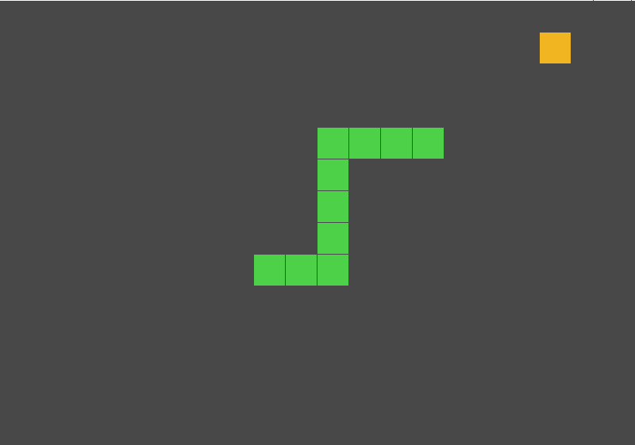

# Snake Game in Fennel

This was a little one night project
to better acquaint myself with [fennel](https://fennel-lang.org/).
It is not very elaborate but the game is complete and playable.

## How to play

The game starts at a random position.
You control the snake by pressing the arrow keys, `wasd` or `hjkl`.

## Dependencies

- LÖVE 11.3
- Lume 2.3.0
- Fennel 0.7.0

Both the Fennel and Lume libraries are bundled with the game in the `lib/` folder.
You only need to have LÖVE installed to run this.
